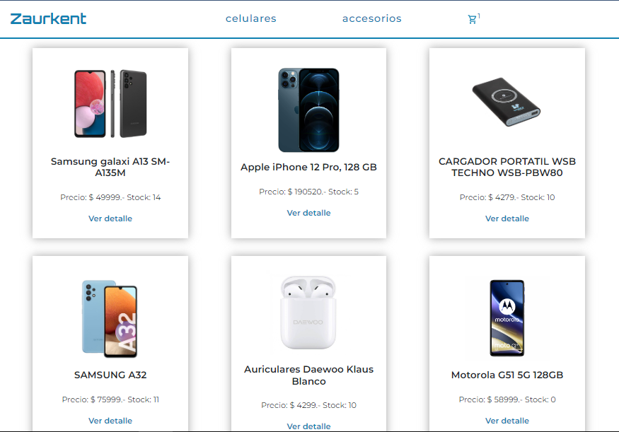

# Proyecto E-commerce en React JS

Repositorio: [E-commerce React](https://github.com/DelCampoFabian/Proyecto-Ecommerce-React) 
Sitio: [Zaurkent-celulares](https://zaurkentcelulares.netlify.app/)

## Descripción 

Proyecto realizado para el curso de React JS en Coderhouse. Se trata de un Ecommerce de venta de celurares y accesorios.

## Funcionalidad

- Ver la lista de todos los productos .
- Filtrar productos por categorias (celulares - accesorios).
- Ingresar a ver el detalle de un producto.
- Agregar productos al carrito de compras.
- Quitar productos o vaciar todo al carrito de compras.
- Finalizar la compra con un formulario.

## Librerias utilizadas

- react-icons para agregar iconos.
- react-spinner para el tiempo de carga.
- react-router-dom para las rutas de la página.
- firebase para manejar los productos y los datos de la compra del usuario.

